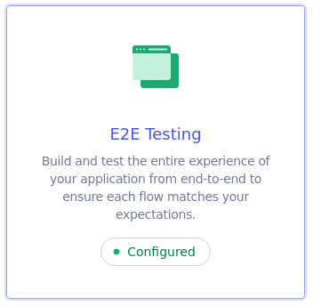
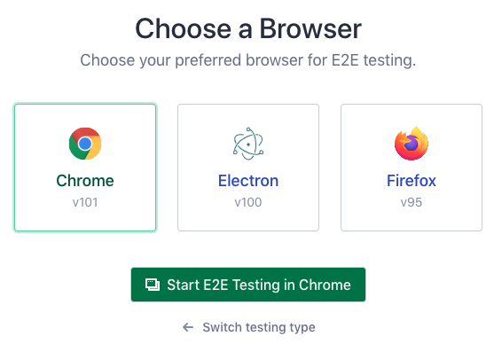
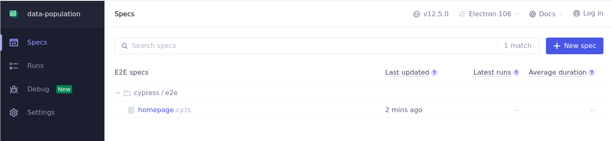

<h1 align="center">
  <p align="center">Data Population</p>
</h1>

## Introdução

Data Population é uma interface web para exibir os dados de população de um determinado bairro da cidade de São José dos Campos.

### Descrição do projeto

A aplicação possui um banco de dados feito com json-server para fazer as requisições do front end e expor os dados na tela.

O front-end foi criado com react-router, e através dos requests na api mock, ele monta os polígonos no mapa que foi criado com react-leaflet. Ao executar o clique em qualquer polígono marcado no mapa, ele abre a evolução populacional daquela determinada área, sendo 4 áreas demarcadas no mapa.

Nesse projeto foi utilizado algumas tecnologias, sendo elas:

Mock-server

- [json-server](https://github.com/typicode/json-server)

UI, Mapa e os gráficos

- [react-router](https://reactrouter.com/en/main)
- [tailwindcss](https://tailwindcss.com/)
- [react-google-charts](https://www.react-google-charts.com/)
- [react-leaflet](https://react-leaflet.js.org/)

Ferramentas utilitárias

- [typescript](https://www.typescriptlang.org/)
- [domain-functions](https://github.com/seasonedcc/domain-functions)
- [zod](https://github.com/colinhacks/zod)

Testes

- [vitest](https://vitest.dev/)
- [react-testing-library](https://testing-library.com/)
- [cypress](https://www.cypress.io/)

### Instalação e execução

Para instalar as dependências, é só executar o comando

```bash
npm install
```

Após instalar as dependências do projeto, é só executar os comandos na ordem

```bash
npm run dbo:run
```

e executar o projeto

```bash
npm run dev
```

### Testes

Para rodar os testes, é só executar o comando

```bash
npm run test
```

E para os testes e2e, só seguir os passos a seguir:

- Executar o script para abrir o cypress

```bash
npm run cypress:open
```

Após isso, clique na opção



Depois escolha em qual irá abrir



> :warning: Se utiliza o wsl / wsl2, dependendo da sua distribuição linux, é necessário instalar as dependências pra se rodar o cypress

Para instalar, digite no terminal:

```bash
apt-get install libgtk2.0-0 libgtk-3-0 libgbm-dev libnotify-dev libgconf-2-4 libnss3 libxss1 libasound2 libxtst6 xauth xvfb
```

Para executar os testes, na aba Spec, clique no teste que queira executar


